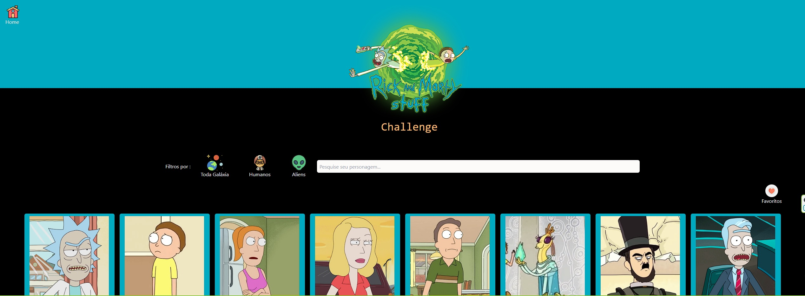

<h1 align="center">
  
</h1>

<p align="center">
  Aplicação de consulta, visualização e cadastro de personagens favoritos do seriado Rick & Morty.
</p>

<br>

## ACESSE A APLICAÇÃO
https://challengetherickandmortybycleiton.netlify.app/


<p align="center">
  
</p>

## O DESAFIO
Você precisa criar uma SPA que vai consumir a The Rick and Morty API. Escreva o código da melhor forma possível, utilizando React.Você pode consumir a api usando GraphQL ou REST, e também pode usar qualquer framework de CSS para acelerar o desenvolvimento, pois o resultado deve ser totalmente responsivo.

Atualmente usamos Graphql e o tailwindcss, mas sinta-se livre para usar o que preferir.Este desafio consiste em uma listagem de personagens do Rick e Morty , exibindo os detalhes sobre cada personagem.


## API
Na aplicação foi utilizada a API pública https://rickandmortyapi.com/documentation/#introduction para o consumo das requisições dos personagens


## REQUISITOS
Deve-se criar uma página que atenda os seguintes requisitos:
* Lista dos personagens com seus respectivos nomes e fotos.
* Busca por personagens (Nome)
* Filtro que permita listar todos, só humanos ou só aliens
* Os filtros devem funcionar sozinhos ou combinados
* Ao clicar no personagem, permitir a visualização detalhada com pelo menos: Nome, status, specie, quantidade de episódios e data de criação
* Permitir criar uma lista de favoritos e adicionar/remover personagens nela (A lista pode ser somente por sessão não precisa salvar em nenhum banco de dados)


## TECNOLOGIAS
Esse projeto foi desenvolvido com as seguintes tecnologias:
- **React JS** 
- **Typescript** 
- **Next Js** 
- **Axios**
- **Tailwindcss** 

## 🤔 Como executar o projeto
```bash
# Clone este repositório
$ git clone https://github.com/cleitonosilva/challenge_TheRickandMorty.git

# Acesse a pasta do projeto no seu terminal
$ cd challenge_TheRickandMorty

# Instale as dependências
$ yarn install

# Execute a aplicação 
$ yarn dev
```

---
<p align="center">by Cleiton Oliveira</p>